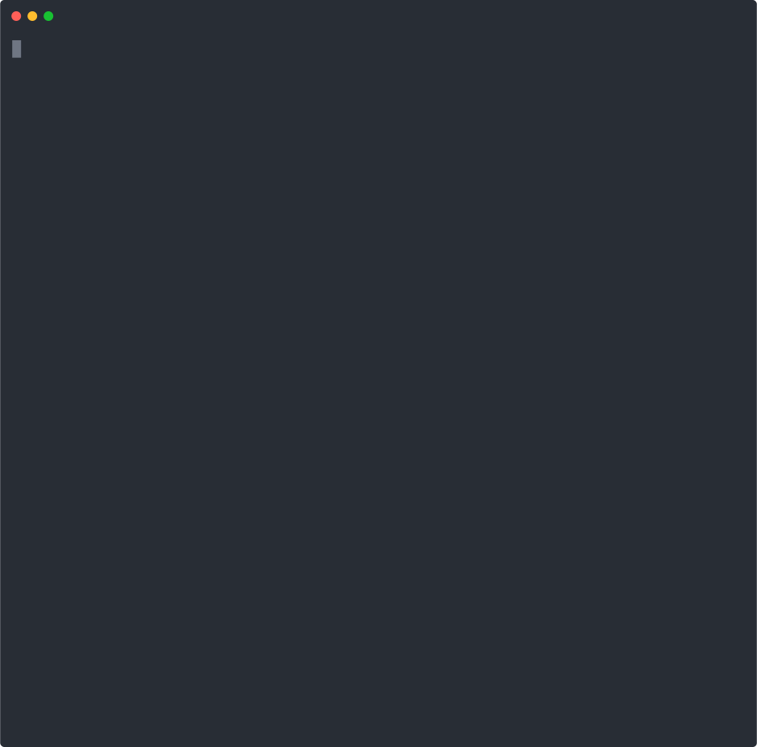

# Warden — AI Treasury Agent

[](https://github.com/helmutdeving/warden/actions/workflows/ci.yml)
[](https://github.com/helmutdeving/warden/actions)
[](https://github.com/tetherto/lib-wallet)

**Warden** is an autonomous treasury agent powered by [Tether WDK](https://github.com/tetherto/lib-wallet). It enforces configurable spending policies, auto-approves routine transfers, escalates large ones, and maintains an immutable audit trail of every decision.

Built for the **Tether WDK Hackathon Galactica** (March 2026).



---

## What it does

Warden sits between your application and your EVM wallet. Every transaction request passes through a policy engine that evaluates it against your configured rules:

| Rule | Behaviour |
|------|-----------|
| **Blacklist** | Hard reject — always, no exceptions |
| **Per-tx limit** | Auto-approve up to `autoApproveLimit`, escalate above |
| **Whitelist** | Trusted addresses get 10× the base limit |
| **Daily cap** | Escalate when cumulative 24-hour spend would exceed `dailyLimit` |
| **Rate limit** | Escalate when transactions-per-hour exceeds `maxTxPerHour` |

Every decision — `APPROVE`, `REJECT`, or `ESCALATE` — is persisted to a SQLite audit log with full context (recipient, amount, reason, timestamp).

---

## Architecture

```
src/
  policy/engine.js    — PolicyEngine: stateless rule evaluator with in-memory rate tracking
  audit/logger.js     — AuditLogger: append-only SQLite log (node:sqlite built-in)
  wallet/treasury.js  — Treasury: WDK EVM wallet wrapper with policy enforcement
  api/server.js       — REST API server (Express)
  demo.js             — Self-contained demo: 6 real transaction scenarios
```

### WDK Integration

Warden uses `@tetherto/wdk-wallet-evm` as its core wallet primitive. The WDK wallet provides:

- **Deterministic key derivation** from a BIP39 seed phrase — no custodial tradeoffs
- **EVM-native signing** — BIP-44 accounts via `WalletManagerEvm` + `account.transfer()`
- **Balance and address queries** — `account.getBalance()`, `account.getAddress()`

The policy engine and audit layer sit **on top of** the WDK wallet — not instead of it. WDK's self-custody guarantees remain intact; Warden only adds a decision gate before any transaction reaches the signing layer.

```js
// src/wallet/treasury.js — core WDK usage
import WalletManagerEvm from '@tetherto/wdk-wallet-evm'

// Initialize with BIP-39 seed + JSON-RPC endpoint
this._manager = new WalletManagerEvm(seed, { provider: rpcUrl })
const account = await this._manager.getAccount(0)   // BIP-44 account #0

// Address and balance via WDK account API
const address = await account.getAddress()            // '0x...'
const balance = await account.getBalance()            // bigint (wei)

// Every submit() call goes through PolicyEngine before WDK signs
const decision = this._policy.evaluate(request)
if (decision.decision === 'APPROVE') {
  const txHash = await account.transfer({             // WDK signs + broadcasts
    to: request.to,
    value: request.value,
    data: request.data
  })
}
```

### REST API

| Method | Path | Description |
|--------|------|-------------|
| `POST` | `/v1/transfer` | Submit a transfer request for policy evaluation |
| `GET`  | `/v1/address`  | Get treasury wallet address |
| `GET`  | `/v1/balance`  | Get current ETH balance |
| `GET`  | `/v1/stats`    | Spending stats (daily, hourly) |
| `GET`  | `/v1/audit`    | Query audit log with optional `?type=&since=&limit=` |

---

## Quickstart

```bash
npm install

# Copy and fill in your config
cp .env.example .env

# Start the API server
npm start

# Run the policy demo (no wallet required)
npm run demo

# Run tests (45 tests, node:test)
npm test
```

### `.env` keys

```
SEED_PHRASE=your twelve word bip39 mnemonic phrase here
RPC_URL=https://mainnet.infura.io/v3/YOUR_KEY
PORT=3000
```

---

## Policy configuration

Pass a `policy` object to `Treasury` or `PolicyEngine`:

```js
import { Treasury } from './src/wallet/treasury.js'

const treasury = new Treasury({
  seed: process.env.SEED_PHRASE,
  rpcUrl: process.env.RPC_URL,
  dbPath: './data/audit.db',
  policy: {
    autoApproveLimit: 10n ** 17n,          // 0.1 ETH per tx
    dailyLimit:       5n * 10n ** 18n,     // 5 ETH per day
    maxTxPerHour:     20,
    whitelist: ['0xPayrollContract...'],   // 10× limit
    blacklist: ['0xSuspiciousAddress...']  // always reject
  }
})

const result = await treasury.submit({
  to: '0xRecipient...',
  value: 5n * 10n ** 16n,   // 0.05 ETH
  reason: 'Monthly subscription payment'
})

console.log(result.decision.decision)  // 'APPROVE' | 'REJECT' | 'ESCALATE'
```

---

## Tests

```
npm test

# Tests 45 | Suites 15 | Pass 45 | Fail 0
```

The test suite covers:

- **PolicyEngine** (28 tests): blacklist, whitelist 10× multiplier, per-tx limits, daily cap, hourly rate limiting, decision shape, spending stats, audit integration
- **AuditLogger** (17 tests): log persistence, type/since/limit filtering, stats aggregation, resilience to malformed events

Tests use Node.js built-in `node:test` and `node:assert` — no test framework dependencies.

---

## Why Warden?

Most treasury solutions are either rigid multisigs (slow, expensive) or raw hot wallets (no guardrails). Warden is the middle layer: an agent that handles the 95% of routine transactions automatically while surfacing the 5% that need human attention.

This makes it ideal for:
- **AI agents** managing operational budgets
- **DAOs** with recurring on-chain obligations
- **Protocols** with automated reward distributions
- Any application where autonomous transfers need programmable oversight

---

## License

MIT
